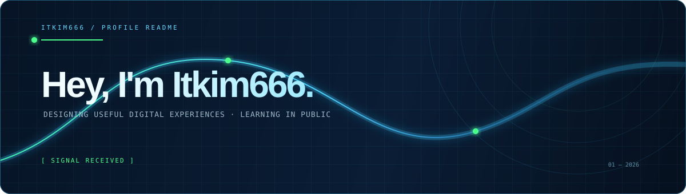

<p align="center">
  
</p>

<p align="center">
  <code>STATUS: ONLINE</code>&nbsp;&nbsp;·&nbsp;&nbsp;<code>BUILDING IN PUBLIC</code>&nbsp;&nbsp;·&nbsp;&nbsp;<code>LEARNING EVERY DAY</code>
</p>

<br />

## / about me

> I design useful digital experiences, explore the web, and learn something new every day.

你好，我是 **Itkim666**。这里是我的公开工作台：记录正在构建的项目、学习中的技术，以及那些值得被留下来的实验。

<table>
  <tr>
    <td width="50%" valign="top">
      <h3>01 / CURRENT MISSION</h3>
      <p>正在打造一个更清晰、更有记忆点的 GitHub 个人空间。</p>
      <p><code>build</code> <code>learn</code> <code>share</code></p>
    </td>
    <td width="50%" valign="top">
      <h3>02 / FOCUS SIGNAL</h3>
      <p>Web · Interface · Creative Development</p>
      <p><code>TypeScript</code> <code>Design</code> <code>Open Source</code></p>
    </td>
  </tr>
</table>

## / selected projects

<table>
  <tr>
    <td width="50%" valign="top">
      <h3><a href="https://github.com/Itkim666/portfolio">portfolio ↗</a></h3>
      <p>A personal space for selected work, experiments, and digital notes.</p>
      <sub>TypeScript · personal site · in progress</sub>
    </td>
    <td width="50%" valign="top">
      <h3><a href="https://github.com/Itkim666/website-design">website-design ↗</a></h3>
      <p>An extensible website template library for creative builds.</p>
      <sub>TypeScript · templates · open source</sub>
    </td>
  </tr>
</table>

## / learning plan

```
┌─────────────────────────────────────────────────────────────┐
│  one small thing · every day                                │
│  read → make → refine → share                               │
└─────────────────────────────────────────────────────────────┘
```

我相信持续的小步迭代，会慢慢形成真正属于自己的作品系统。

## / connect

社交链接正在整理中。新的项目和链接会在这里持续更新。

<p align="right"><sub>signal received · last updated 2026</sub></p>
